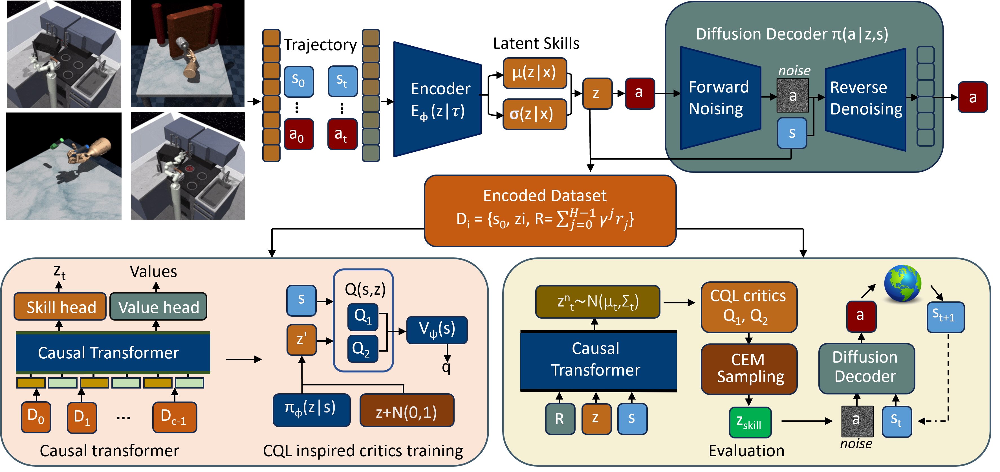
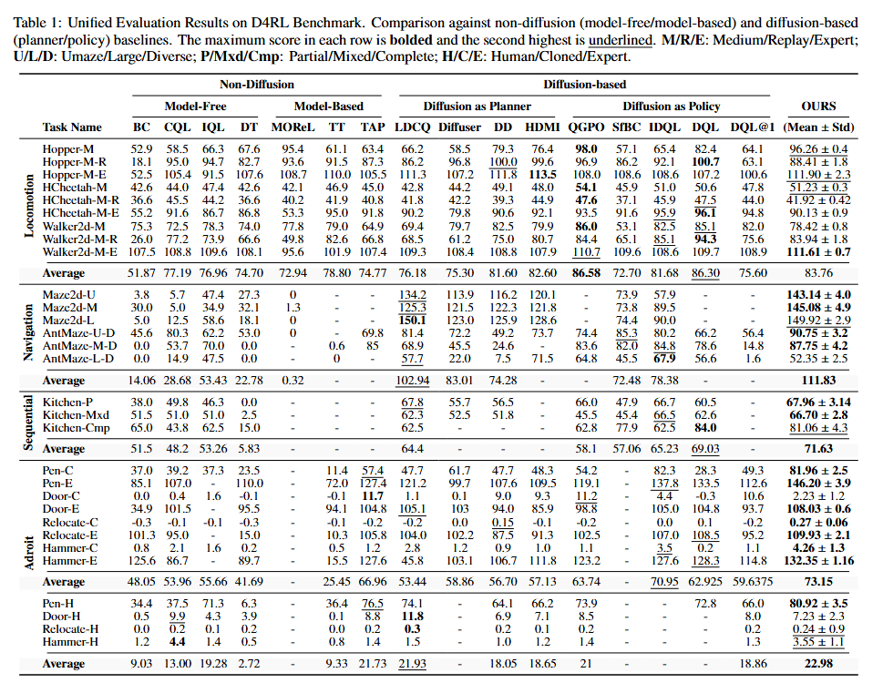
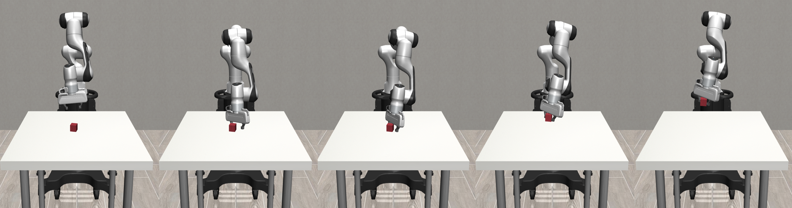

# GRALP: Generative Representation for Action Refinement and Latent Planning

(OFFICIAL DETALIED CODE IMPLEMENTATION WILL BE UPDATED SOON AFTER ACCEPTANCE.....)

This repository contains the official implementation of **GRALP**, a framework for **long-horizon offline robotic control** that balances **support preservation** and **controllability** through a principled architectural separation.

GRALP confines generative modeling to **action execution** while performing **planning and value estimation directly in latent space**, enabling reliable long-horizon composition from fixed datasets without trajectory-level diffusion planning at inference time.

This code accompanies the IJCAI submission:

> **GRALP: Support-Preserving Latent Planning for Long-Horizon Offline Robotic Control**

---

## Overview

Offline robotic control must reason over long horizons while strictly avoiding out-of-distribution actions. GRALP addresses this challenge by decomposing control into two stages:

1. **Latent Skill Learning**  
   A diffusion-based decoder reconstructs short, dataset-consistent motion fragments conditioned on latent skills.

2. **Latent-Space Planning**  
   Conservative critics and a Transformer planner operate directly in latent space, enabling efficient long-horizon composition without diffusion sampling during planning.

  

*Figure: GRALP architecture. Diffusion is used exclusively for action execution, while planning and value learning occur in latent space.*

---

## Key Contributions

- **Support–Controllability Design**  
  GRALP balances dataset support preservation with latent controllability through conservative planning and geometric regularization.

- **Efficient Long-Horizon Planning**  
  Planning is performed entirely in latent space using a Transformer and CEM, avoiding trajectory-level diffusion at inference.

- **Strong Empirical Performance**  
  GRALP achieves state-of-the-art average performance on long-horizon D4RL domains and high success rates on contact-rich RoboSuite manipulation using offline human demonstrations.

---

## Experimental Results

### D4RL Benchmark Summary

  

*Table: Unified D4RL results across Navigation, Sequential Manipulation, Dexterous Manipulation, and Locomotion.*

GRALP achieves the highest average performance on **Navigation**, **Sequential (Kitchen)**, and **Adroit** domains, while remaining competitive on **Locomotion**.

---

### RoboSuite Manipulation (Offline Human Demonstrations)

We additionally evaluate GRALP on RoboSuite manipulation tasks using offline teleoperation data.

#### Lift
- **Success Rate:** 94.6% ± 2.1%
- **10 seeds, 25 rollouts per seed**

#### Pick-and-Place (Can)
- **Success Rate:** 92.3% ± 3.4%
- **10 seeds, 25 rollouts per seed**

  

  

#### Videos
- 📹 **Lift rollout:** `videos/robosuite_lift.mp4`
- 📹 **Pick-and-Place rollout:** `videos/robosuite_pick_place.mp4`

---

## Repository Structure

