# GRALP: Generative Representation for Action Refinement and Latent Planning

This repository contains the official implementation of **GRALP**. This repository contains a research implementation. The code is organized to reproduce the results described in the accompanying paper included in this repository.

<div align="center">
  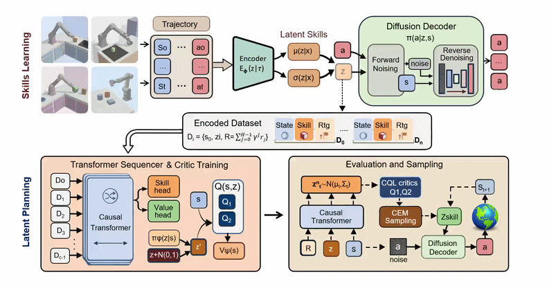<br>
  <b>📹 Gralp</b>
</div>

## Repository Structure

- `datasets/` – data loading, preprocessing and normalization utilities for D4RL datasets
- `models/` – neural network and diffusion model definitions
- `training/` – training scripts for autoencoder, IQL and evaluation
- `utils/` – helper modules for logging, video rendering and miscellaneous utilities

## Requirements

The codebase targets **Python 3.8+**. Install dependencies using the provided `requirements.txt`:

```bash
pip install -r requirements.txt
```

`mujoco-py` and 'robosim' requires the MuJoCo physics engine and an available OpenGL context. Please follow the [MuJoCo installation guide](https://github.com/openai/mujoco-py/) to set up the required libraries.
 

## Quick Start

1. **Clone the repository**

```bash
git clone <repository-url>
cd GRALP
```

2. **Install dependencies**

```bash
pip install -r requirements.txt
```

3. **Run the training pipeline**

The full pipeline consists of four stages: training the diffusion autoencoder, creating an encoded dataset for Planning, training the latent planning Transformer agent and finally evaluating the agent.

Example for a HalfCheetah environment:

```bash
# Train the diffusion autoencoder
python training/train_AE_main.py --env_name antmaze-medium-diverse-v2

# Collect an encoded dataset
python training/prepare_transformer_data.py --env_name antmaze-medium-diverse-v2

# Train the IQL policy
python training/train_transformer_main.py --env_name antmaze-medium-diverse-v2

# Evaluate the trained agent
python training/eval.py --env_name antmaze-medium-diverse-v2
```

Command line arguments in each script allow further customisation (batch sizes, seed values, number of timesteps, etc.). Refer to the source code for a full list of options.


This code accompanies the paper submission:

> **GRALP: Support-Preserving Latent Planning for Long-Horizon Offline Robotic Control**

---

<!-- ## Overview
  
Offline robotic control must reason over long horizons while strictly avoiding out-of-distribution actions. GRALP addresses this challenge by decomposing control into two stages:

1. **Latent Skill Learning**  
   A diffusion-based decoder reconstructs short, dataset-consistent motion fragments conditioned on latent skills.

2. **Latent-Space Planning**  
   Conservative critics and a Transformer planner operate directly in latent space, enabling efficient long-horizon composition without diffusion sampling during planning.

<p align="center">
  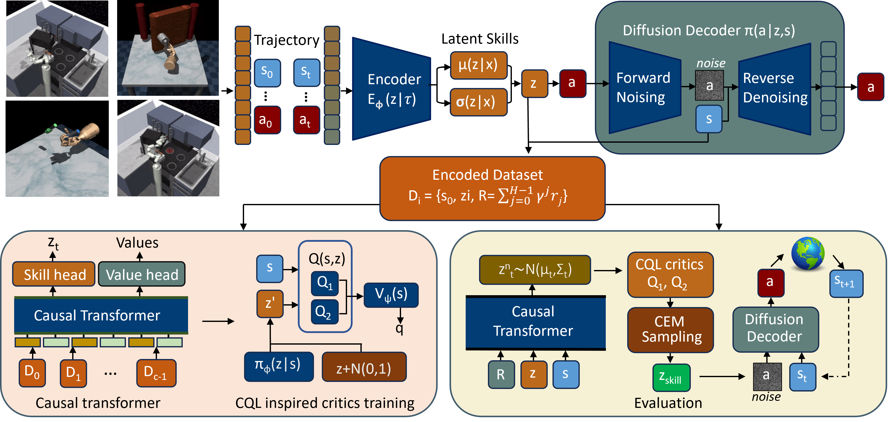
</p>

*Figure: GRALP architecture. Diffusion is used exclusively for action execution, while planning and value learning occur in latent space.*
---
-->


## Model Architecture

GRALP consists of four components: a trajectory encoder, a state-conditional latent prior, a diffusion-based action decoder, and a latent-space planner trained with conservative value estimation.

**Trajectory Encoder and Prior**
The encoder is a 2-layer GRU with hidden size 256. The final forward and backward hidden states are concatenated and passed through linear heads to predict: Mean: $\mu_\phi \in \mathbb{R}^{d_z}$ and Log-variance: $\log \sigma_\phi$. The state-conditional prior is implemented as a 2-layer MLP (width 256, ReLU activations).

**Diffusion Action Decoder**
The decoder models using a temporal U-Net with FiLM conditioning. At each diffusion step $k$, the network predicts the noise term $\hat{\epsilon}_\theta$ used in the diffusion loss (Eq. (6) in the main paper).

**Latent Critics**
We train two Q-functions $Q_1(s, z)$ and $Q_2(s, z)$, along with a value function $V(s)$. Each critic is implemented as a 3-layer MLP with: Width: 256 and Activations: ReLU

**Transformer Planner**
The planner predicts a Gaussian distribution over the next latent skil.  These are processed by a causal Transformer with: Layers: 8, Attention heads: 8, Embedding dimension: 256. 


## Hyperparameters

This section summarizes the hyperparameters used in GRALP. Unless otherwise specified, all hyperparameters are held fixed across environments, with only task-dependent parameters (e.g., CQL strength, RTG targets, and skill horizons) tuned using standard validation protocols. Tables are organized by training stage and evaluation usage. All ablations and comparisons use the same hyperparameters as the full GRALP model unless stated otherwise.


**Stage 1: Latent Skill Model**

Stage 1 trains the diffusion-based latent skill model described in Section III-B.

| Parameter                               | Value                                           |
| --------------------------------------- | ----------------------------------------------- |
| Latent dimension $d_z$                  | 16                                              |
| GRU hidden size                         | 256                                             |
| Diffusion schedule                      | Linear                                          |
| Batch size                              | 256                                             |
| Learning rate (encoder, prior)          | $3 \times 10^{-4}$                              |
| Learning rate (decoder)                 | $1 \times 10^{-4}$                              |
| KL weight $\beta_{\text{KL}}$           | $5 \times 10^{-4} \rightarrow 4 \times 10^{-2}$ |
| Z-Force weight $\lambda_{\text{force}}$ | 0.01                                            |
| State dropout probability               | $0.7 \rightarrow 0.3$                           |
| Optimizer                               | AdamW                                           |
| Gradient clipping                       | 1.0                                             |


**Stage 2: Planner and Critics**

Stage 2 operates entirely in the pre-encoded latent space, training conservative critics and a Transformer-based planner as described in Section III-C.

| Parameter                  | Value                     |
| -------------------------- | ------------------------- |
| Critic hidden width        | 256                       |
| Expectile $\tau$           | 0.8                       |
| CQL coefficient $\alpha$   | 0.5–5.0 (domain-specific) |
| Planner learning rate      | $1 \times 10^{-4}$        |
| Critic learning rate       | $3 \times 10^{-4}$        |
| AWR temperature $\tau$     | 2.0                       |
| Transformer layers / heads | 8 / 8                     |
| Context length             | 12–16                     |
| Batch size                 | 256                       |
| Optimizer                  | AdamW                     |


**Return-to-Go (RTG) Targets**

For evaluation, GRALP conditions the planner on fixed return-to-go (RTG) targets, following standard practice in return-conditioned sequence models.

| Environment | Normalized Target RTG |
| ----------- | --------------------- |
| Kitchen     | 3–4                   |
| Antmaze     | 5                     |
| Maze2D      | 2                     |
| Locomotion  | 2–5                   |
| Adroit      | 3–6                   |
| Robosim     | 3                     |

**Skill Horizons**

The skill horizon $H$ determines the temporal abstraction level at which planning operates.

| Environment | Horizon $H$ |
| ----------- | ----------- |
| Kitchen     | 12          |
| Antmaze     | 8           |
| Maze2D      | 12          |
| Locomotion  | 12          |
| Adroit      | 8           |
| Robosim     | 8           |


**Compute and Reproducibility**

All experiments are conducted on NVIDIA RTX 3090 or A100 GPUs, using a single GPU per run. Training is fully offline and does not require environment interaction. For each task, GRALP is trained independently with fixed hyperparameters, and performance is evaluated using 10 random seeds, reporting mean ± standard deviation following the standard D4RL protocol.

Evaluation is performed using deterministic latent planning and deterministic DDIM decoding ($\eta = 0$), ensuring consistent execution across runs. Each seed is evaluated using 25 rollouts, and normalized returns are computed using the environment-specific random and expert baselines provided by D4RL. Final results are reported from the training checkpoint with the highest validation return.

To ensure reproducibility, all random number generators (PyTorch, NumPy, and environment seeds) are explicitly controlled, and all experiments are run with fixed training schedules and evaluation protocols. Training scripts, configuration files, and pretrained model checkpoints will be released upon publication.


## Experimental Results

### D4RL Benchmark Summary

<p align="center">
  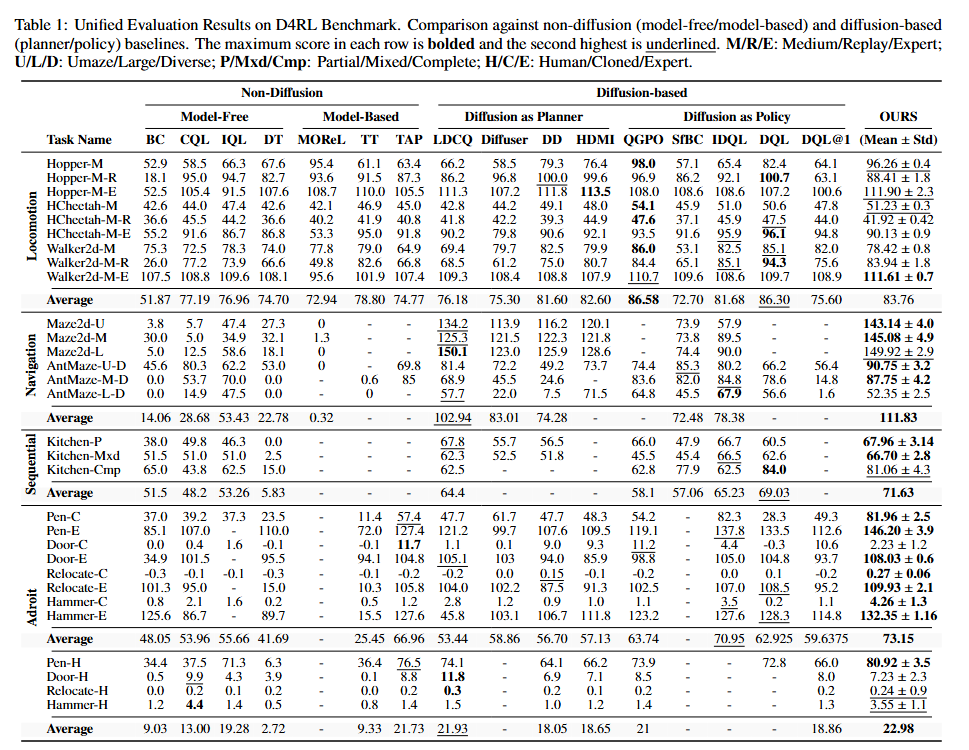
</p>

*Table: Unified D4RL results across Navigation, Sequential Manipulation, Dexterous Manipulation, and Locomotion.*

GRALP achieves the highest average performance on **Navigation**, **Sequential (Kitchen)**, and **Adroit** domains, while remaining competitive on **Locomotion**.

---

### RoboSuite Manipulation (Offline Human Demonstrations)

We additionally evaluate GRALP on RoboSuite manipulation tasks using offline teleoperation data.

#### Lift
- **Success Rate:** 94.6% ± 2.1%
- **10 seeds, 25 rollouts per seed**

#### Pick-and-Place (Can)
- **Success Rate:** 92.3% ± 3.4%
- **10 seeds, 25 rollouts per seed**

<!-- <p align="center">
  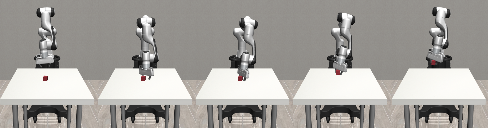
</p>

<p align="center">
  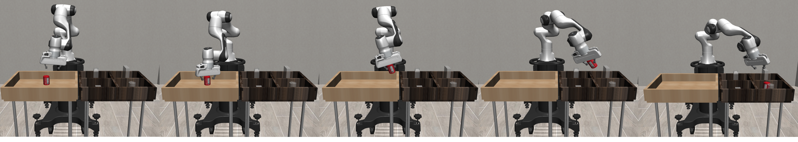
</p> -->

#### Videos
Note: *Videos Renderring speed might varies due to third party anonymous gutub server. For better quality view, try to download the videos from Videos/ folder* 
<div align="center">

<table align="center">
  <tr>
    <td align="center">
      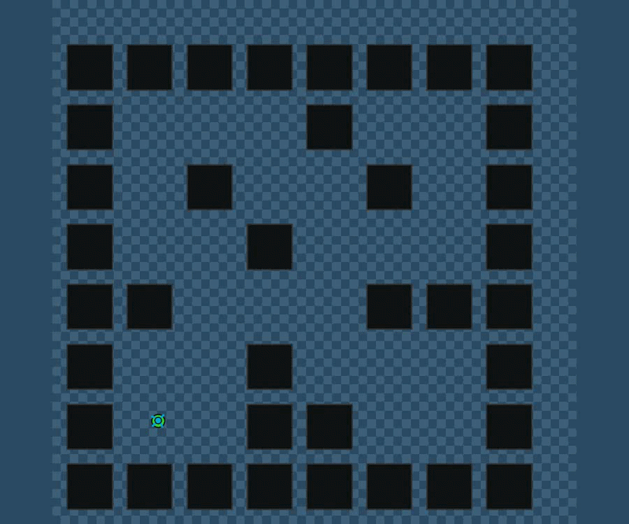<br>
      <b>📹 Maze [Navigation]</b>
    </td>
    <td align="center">
      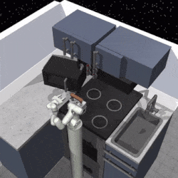<br>
      <b>📹 Kitchen [Sequential]</b>
    </td>
  </tr>
</table>

<br>

<table align="center">
  <tr>
    <td align="center">
      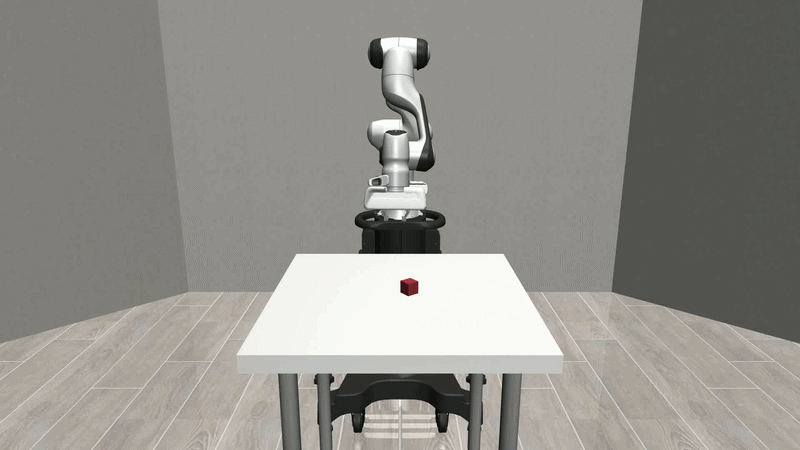<br>
      <b>📹 Lift rollout</b>
    </td>
    <td align="center">
      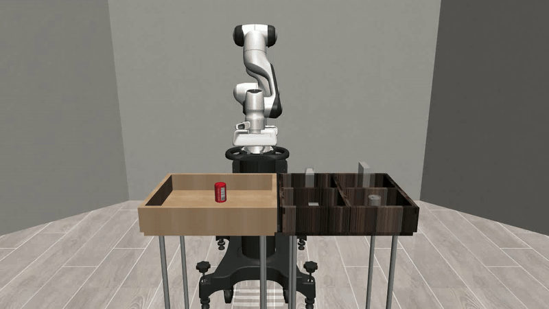<br>
      <b>📹 Pick-and-Place rollout</b>
    </td>
  </tr>
</table>

<br>

<table align="center">
  <tr>
    <td align="center">
      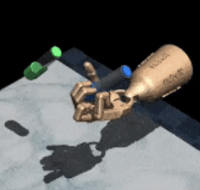<br>
      <b>📹 Pen Manipulation [Adroit]</b>
    </td>
    <td align="center">
      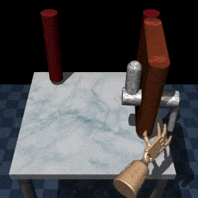<br>
      <b>📹 Door [Adroit]</b>
    </td>
  </tr>
</table>

</div>


## Citation

If you use this code in your research, please cite the accompanying paper:

```

```

